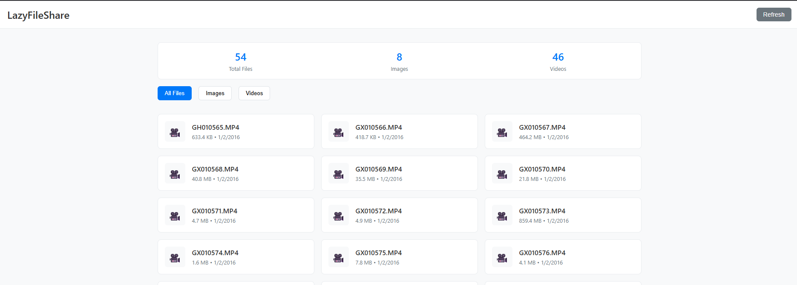

# LazyFileShare – Node.js Local File Sharing Server

**LazyFileShare** is a lightweight, blazing-fast Node.js file-sharing server for LAN networks. Share images, videos, and other files from any folder on your computer — accessible instantly from any device on your local Wi-Fi.




> 📡 Turn your PC into a personal media server – no setup, no cloud, just local and instant.

---

## ⚙️ Features

- 📁 **Simple Setup** – Just point to a folder and start sharing
- 🖼️ **Image Support** – JPG, PNG, GIF, BMP, WebP, SVG, ICO, TIFF
- 🎥 **Video Support** – MP4, AVI, MKV, MOV, WMV, FLV, WebM, M4V, 3GP, OGV
- 🌐 **Web Interface** – Clean, responsive UI to browse, view, or download
- 🔄 **Auto Refresh** – Automatically scans for new files
- 📱 **Mobile Friendly** – Works on phones, tablets, and TVs
- 🔒 **Safe by Default** – Only serves files from the specified directory
- ⚡ **No Cloud or Internet Required** – 100% local, works offline

---

## 🚀 Quick Start

```bash
# 1. Install dependencies
npm install

# 2. Start the server
node server.js <folder-path>
# Example:
node server.js C:\Users\YourName\Pictures
```

Then open your browser:

- Local access → `http://localhost:3000`
- LAN access → `http://<your-ip>:3000`

---

## 📁 Project Structure

```
LazyFileShare/
├── server.js              # Main server entry point
├── package.json           # Dependencies and scripts
├── public/
│   └── index.html         # Web interface
└── src/
    ├── config/
    │   └── constants.js
    ├── middleware/
    │   └── errorHandler.js
    ├── routes/
    │   └── api.js
    ├── services/
    │   └── fileService.js
    └── utils/
        └── fileScanner.js
```

---

## 🔌 API Endpoints

- `GET /api/info` – Server information
- `GET /api/files` – List all files
- `GET /api/files/:type` – List files by type (images/videos)
- `GET /api/file/:path` – Serve a specific file
- `POST /api/refresh` – Refresh file list

---

## 🧪 Development

```bash
# Start with auto-reload
npm run dev

# Start production server
npm start
```

---

## 📦 Dependencies

- [`express`](https://www.npmjs.com/package/express) – Web framework
- [`cors`](https://www.npmjs.com/package/cors) – Cross-origin support
- [`mime-types`](https://www.npmjs.com/package/mime-types) – MIME detection
- [`nodemon`](https://www.npmjs.com/package/nodemon) – Dev auto-reload

---

## 🧠 Use Cases

- Share videos and photos from PC to mobile or smart TV
- Set up a temporary media server on local WiFi
- Transfer files between devices without USB, cloud, or Bluetooth

---

## 🔍 Keywords (for SEO)

> nodejs file server, local file sharing, media server LAN, express file browser, serve videos over wifi, lightweight file server, file share app node

---

---

## 👤 Author

[Suraj Barailee](https://github.com/surajbarailee)

